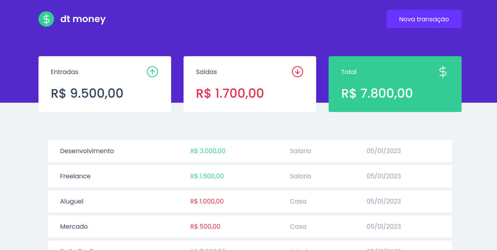
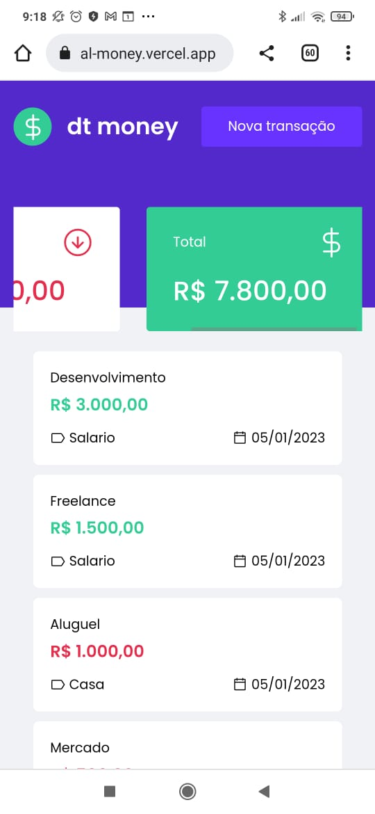

# DT Money 2.0 

Projeto Web desenvolvido durante o Ignite by Rocketseat • Trilha ReactJS - TEMA: "DT Money" 💲

### Descrição:

- [x] Listagem das transações (entradas e saídas);
- [x] Cálculo das entradas, saídas e total;
- [x] Modal para cadastro de nova transação;

### Adicionais:
- [x] Layout responsivo (mobile e desktop).

## Tecnologias utilizadas: 🚀

- ReactJs 
- React-dom 
- React-modal
- Typescript
- Styled Components 
- React Hook Form 
- JSON-Server 
- Axios
- Miragejs: 
- Phosphor-react

### Desktop (screenshot):

### Mobile (screenshot):

### Dê uma olhada como o projeto ficou!

https://al-money.vercel.app/

 
